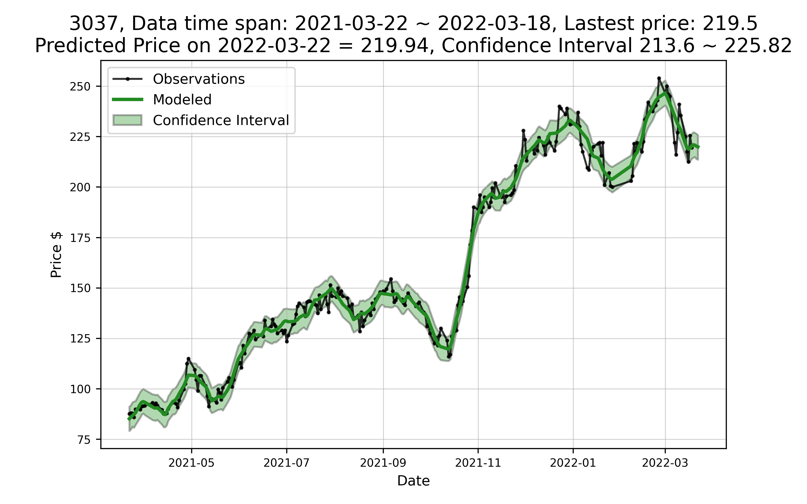

# Stock App
## Reference
- [https://towardsdatascience.com/stock-prediction-in-python-b66555171a2](https://towardsdatascience.com/stock-prediction-in-python-b66555171a2)
- [https://github.com/WillKoehrsen/Data-Analysis](https://github.com/WillKoehrsen/Data-Analysis)
- [https://github.com/syuraj/stocks-prediction-engine#readme](https://github.com/syuraj/stocks-prediction-engine#readme)

## Introduction
Crawl all listed companies history price and use "prophet" to predict future price

Stock App has 3 different docker containers <br>
- MariaDB: Store stock symbol, history prices and predicted results <br>
- Crawler: A crawler that could crawl history prices from cnyes(鉅亨網) via Tor <br>
- API: A Python Flask API that could predict future price via prophet <br>

## Establish services

### Change the DB password


```
nano image/stock_crawler/crontab

# Set up your DB password for crawler
MYSQL_ROOT_PASSWORD=[Your password]
MYSQL_PASSWORD=[Your password]


nano container/env_files/db.env 

# Set up your DB password for API
MYSQL_ROOT_PASSWORD=[Your password]
MYSQL_PASSWORD=[Your password]
```

### Build all containers and check if all containers have been created and run successfully

```
docker-compose --compatibility up -d
docker ps -a
```

### Enter the crawler container and activate crawler python scripts manually

```
docker exec -it stock_crawler bash

# Download opendata to get and update stock symbol
python scheduler/download_opendata.py

# Download all stocks history prices from cynes
python scheduler/download_stock_history.py

# Download buy and sell history from cynes
python scheduler/download_stock_buy_sell.py

# Your can also change default trigger interval of each python scrpit
crontab -e
```

### After all history data have been crawled to DB, you may predict the stock future price by calling API

Please make sure you have download any API development tool, such as Postman or Insomnia <br>

#### Predict future pirce

```
URL:
	http://127.0.0.1:12345/predict/prophet
Method:
	POST
Content-Type:
	application/json
Body:
	{
	    "stock_code": [String: The stock symbol of specific company that you want to predict future price], 
	    "days": [Integer: How many days that you want to predict],
	    "training_years": [Integer: How many yearly history data that you want implement to predict model],
	    "training_months": [Integer How many monthly history data that you want implement to predict model]
	}
Calling date: 2022-03-18
```

For example: 

```
curl -XPOST http://127.0.0.1:12345/predict/prophet \
    -H 'Content-Type: application/json' \
    -d '{
	    "stock_code": "3037", 
	    "days": 3,
	    "training_years": 1,
	    "training_months": 0
	}'
```

And the response will be like:

```
{
    "result": {
        "confidence_max": 226.27,
        "confidence_min": 213.81,
        "date": "2022-03-18",
        "fluctuation": 0.44,
        "fluctuation_percent": 0.002,
        "predicted_date": "2022-03-22",
        "predicted_price": 219.94,
        "price": 219.5,
        "stock_code": "3037"
    },
    "status": true
}
```
status: Boolean, the API execution status <br>
result <br>
&nbsp;&nbsp;&nbsp;&nbsp;confidence\_max: Float, uncertainty interval price max value <br>
&nbsp;&nbsp;&nbsp;&nbsp;confidence\_min: Float, Uncertainty interval price min value <br>
&nbsp;&nbsp;&nbsp;&nbsp;date: String, The predict date <br>
&nbsp;&nbsp;&nbsp;&nbsp;fluctuation: Float, The fluctuation between predicted\_price and price <br>
&nbsp;&nbsp;&nbsp;&nbsp;fluctuation\_percent: Float, The fluctuation percent between predicted\_price and price <br>
&nbsp;&nbsp;&nbsp;&nbsp;price: Float, The stock last price <br>
&nbsp;&nbsp;&nbsp;&nbsp;stock\_code: String, The stock symbol <br>

#### Get the stock symbols array that have already be predicted

```
URL:
	http://127.0.0.1:12345/predict_result?purpose=LIST_PREDICTED_RESULT
Method:
	GET
```

For example: 

```
curl -XGET "http://127.0.0.1:12345/predict_result/?purpose=LIST_PREDICTED_RESULT"
```

And the response will be like:

```
{
    "result": [
        "1101",
        "1102",
			...
    ],
    "status": true
}
```
status: Boolean, the API execution status <br>
result: An array of stock symbols that already be predicted

#### Check if the prophet predicted result picture is exist

```
URL:
	http://127.0.0.1:12345/predict_result/?purpose=CHECK_PICTURE&stock=3037
Method:
	GET
```

For example: 

```
curl -XGET "http://127.0.0.1:12345/predict_result/?purpose=CHECK_PICTURE&stock=3037"
```

And the response will be like:

```
{
    "status": true
}
```
status: Boolean, the API execution status <br>


#### Get the prophet predicted result picture

```
URL:
	http://127.0.0.1:12345/predict_result/?purpose=DOWNLOAD_PICTURE&stock=3037
Method:
	GET
```

For example: 

```
curl -XGET "http://127.0.0.1:12345/predict_result/?purpose=DOWNLOAD_PICTURE&stock=3037"
```

And the response will be like:




### Check the Data in database

You can also access the MySQL database to get all data

```
# Login to MySQL server
# On host
mysql -u stocker -h 127.0.0.1 -p Stock --port=33306
# In container
mysql -u stocker -h stock_mysql -p Stock

# Get companies
SELECT * FROM Stock.stock_info;

# Get buy and sell history
SELECT * FROM Stock.stock_buy_sell
where stock_code='1101'
order by date desc;

# Get spcific company price history
SELECT * FROM Stock.stock_history
where stock_code='1101'
order by date desc;

# Get spcific company predicted result
SELECT * FROM Stock.predicted_result
where stock_code='1101';
```

## Delete all services
```
# Because the DB data has already mount to container/volumes/stock_mysql_vol
# So delete all services does not mean delete all data
docker-compose down
docker rmi stock_crawler:1.0 stock_api:1.0 mariadb:10.6.2
```


